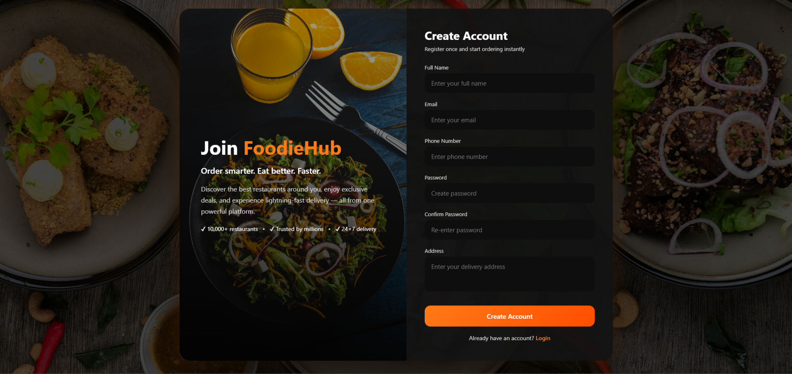
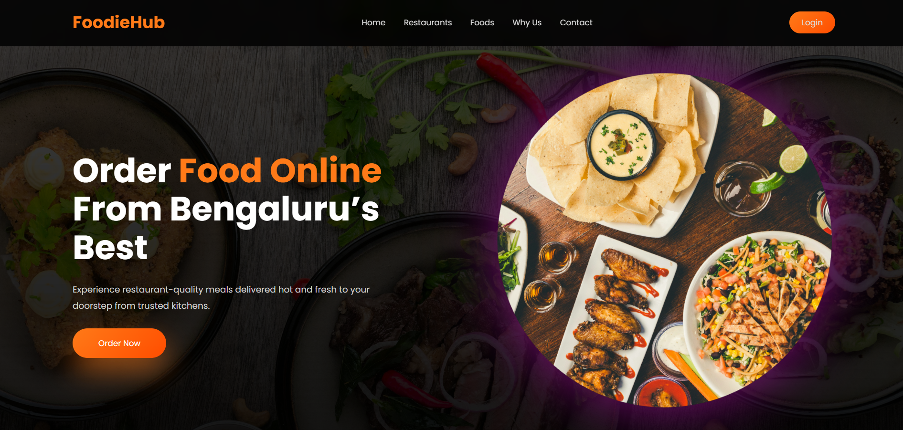
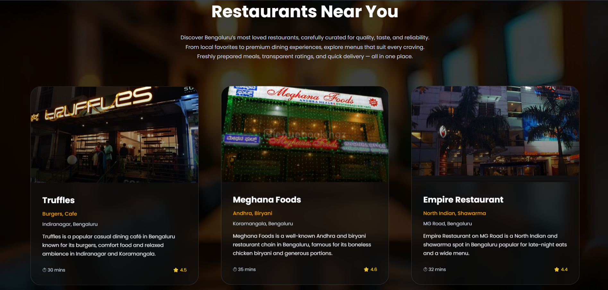
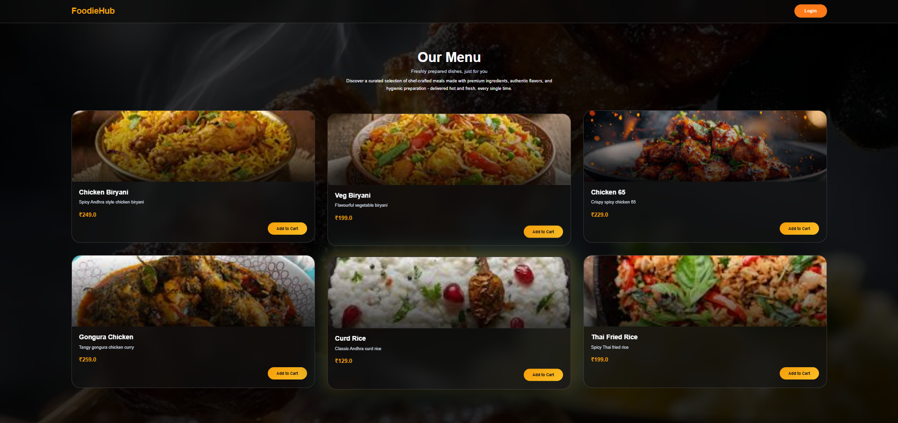
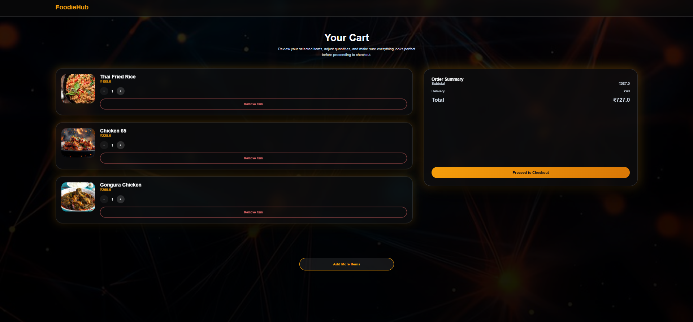
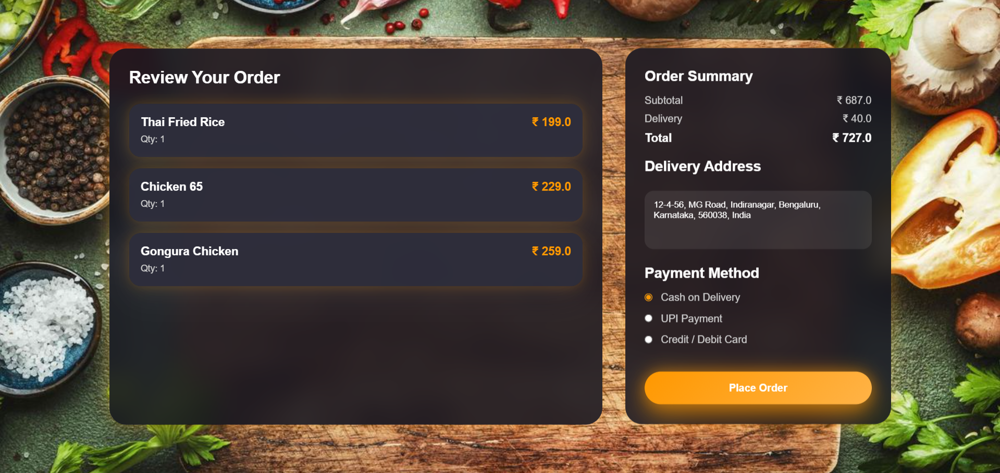
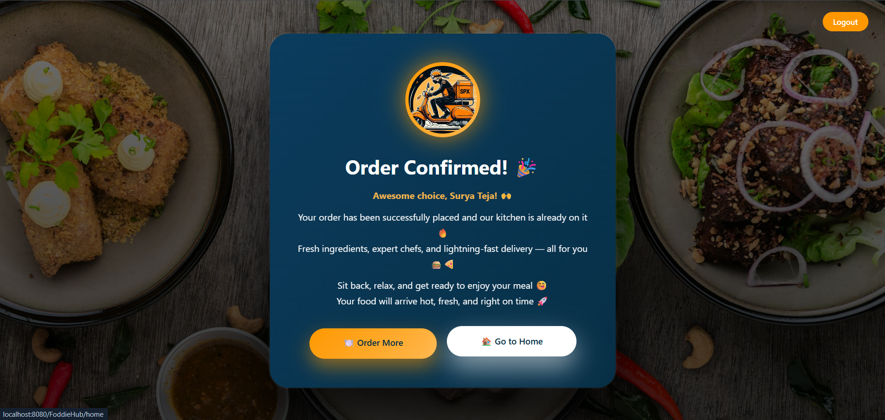

# 🍔 FoodieHub – Online Food Delivery Web Application

FoodieHub is a Java Full Stack Online Food Ordering Web Application developed using JSP, Servlets, JDBC, and MySQL, following a clean MVC + DAO architecture.

This project demonstrates real-world Java web application development with proper separation of concerns, layered backend design, and structured request-to-database flow. It is built as a portfolio-grade and interview-ready project that closely reflects enterprise-style Java web application practices.

---

## 🚀 Project Vision

FoodieHub simulates a complete online food ordering system where users can browse restaurants, view menus, manage a cart, and place orders.

The project focuses on:
- Clean MVC architecture
- DAO-based persistence layer
- Clear request handling using Servlets
- Maintainable and scalable Java web design

---

## 👥 Target Users

- Customers  
  Browse restaurants and menus, manage cart, and place food orders.

- Admin / Restaurant Owners  
  Manage food items and view placed orders.

- Delivery (Future Scope)  
  Can be extended to support delivery tracking and order fulfillment.

---

## ✨ Features

### User Features
- User registration
- Login and logout using session management
- View list of restaurants
- View menu for a selected restaurant
- Add food items to cart
- Update cart item quantity
- Remove items from cart
- Place food order
- View order confirmation and order success page

### Admin / Restaurant Features
- Add food items
- Update food item details
- Delete food items
- View placed customer orders

---

## 🛠️ Tech Stack

Backend:
- Java
- JSP & Servlets
- JDBC
- MVC + DAO Architecture

Frontend:
- HTML
- CSS
- JavaScript

Database:
- MySQL

Tools & Server:
- Eclipse IDE (Dynamic Web Project)
- Apache Tomcat
- Git & GitHub

---

## 🧱 Architecture Overview (MVC + DAO)

FoodieHub follows a layered MVC + DAO architecture:

JSP (View)  
→ Servlet (Controller)  
→ DAO Interface  
→ DAO Implementation (JDBC)  
→ MySQL Database  
→ Model Objects  
→ JSP renders response  

Each layer has a single responsibility, ensuring clean code and easy maintenance.

---

## 🔄 Application Flow

User Flow:
Home Page  
→ Restaurant Listing  
→ Menu Page  
→ Cart  
→ Order Confirmation  
→ Order Success  

Sample Execution Flow:
menu.jsp  
→ MenuServlet  
→ MenuDAO  
→ MenuDAOImpl  
→ MySQL  

---

## 📁 Project Structure (Exact Eclipse Structure)

FoodieHub Project
│
├── src/main/java
│   └── com.food
│       ├── dao
│       │   ├── MenuDAO.java
│       │   ├── OrderDAO.java
│       │   ├── OrderItemDAO.java
│       │   ├── RestaurantDAO.java
│       │   └── UserDAO.java
│       │
│       ├── daoimpl
│       │   ├── MenuDAOImpl.java
│       │   ├── OrderDAOImpl.java
│       │   ├── OrderItemDAOImpl.java
│       │   ├── RestaurantDAOImpl.java
│       │   └── UserDAOImpl.java
│       │
│       ├── model
│       │   ├── Cart.java
│       │   ├── CartItem.java
│       │   ├── Menu.java
│       │   ├── Order.java
│       │   ├── OrderItem.java
│       │   ├── Restaurant.java
│       │   └── User.java
│       │
│       ├── servlet
│       │   ├── CartServlet.java
│       │   ├── HomeServlet.java
│       │   ├── LoginServlet.java
│       │   ├── LogoutServlet.java
│       │   ├── MenuServlet.java
│       │   ├── OrderServlet.java
│       │   ├── RegisterServlet.java
│       │   └── RestaurantServlet.java
│       │
│       └── util
│           └── DBConnection.java
│
├── src/main/webapp
│   ├── images
│   │   ├── restaurants
│   │   └── itemimages
│   │
│   ├── cart.jsp
│   ├── cart.css
│   ├── home.jsp
│   ├── home.css
│   ├── login.jsp
│   ├── login.css
│   ├── register.jsp
│   ├── register.css
│   ├── restaurant.jsp
│   ├── restaurant.css
│   ├── menu.jsp
│   ├── menu.css
│   ├── orderConfirm.jsp
│   ├── orderConfirm.css
│   ├── orderSuccess.jsp
│   └── orderSuccess.css
│
├── WEB-INF
│   ├── lib
│   └── web.xml
│

.gitignore  
README.md  

---

## 🖼️ Screenshots & UI Flow

All UI screenshots are organized to clearly represent the actual user navigation flow in the application.  
Screenshots are named using SEO-friendly conventions to improve GitHub readability and recruiter visibility.

## 📸 UI Screenshots – FoodieHub

This folder contains UI screenshots of the FoodieHub application.

The screenshots are organized according to the actual user navigation flow:
Login → Register → Home → Restaurant → Menu → Cart → Order Confirmation → Order Success.

All images reflect real JSP pages from the application and are intended for GitHub reviewers and interview discussions.

assets/screenshots

assets/screenshots
├── login-page
│   └── foodiehub-login-page.png
│
├── register-page
│   └── foodiehub-register-page.png
│
├── home-page
│   └── foodiehub-home-page.png
│
├── restaurant-page
│   └── foodiehub-restaurant-listing-page.png
│
├── menu-page
│   └── foodiehub-menu-page.png
│
├── cart-page
│   └── foodiehub-cart-page.png
│
├── order-confirm-page
│   └── foodiehub-order-confirmation-page.png
│
└── order-success-page
    └── foodiehub-order-success-page.png

Screenshot usage examples:

Login Page:

Register Page:

Home Page:

Restaurant Listing Page:

Menu Page:

Cart Page:

Order Confirmation Page:

Order Success Page:

---

## 🗄️ Database Design

Database Name: online_food_delivery

Tables:
- user
- restaurant
- menu
- orders
- orderitem

Database View:
- v_order_billing (consolidated billing and order summary)

All SQL scripts and sample data are available inside the database folder.

---

## ⚙️ Setup & Run Instructions

Prerequisites:
- Java 8 or higher
- Eclipse IDE
- Apache Tomcat
- MySQL

Steps:
1. Clone the repository
2. Import the project into Eclipse as a Dynamic Web Project
3. Configure Apache Tomcat server
4. Execute SQL scripts from the database folder
5. Update database credentials in DBConnection.java
6. Run the project on Tomcat
7. Access the application through browser

---

## 🔐 Security Notes

- Database credentials are masked or excluded
- Sample data uses dummy values
- .gitignore prevents committing sensitive and IDE-specific files

---

## 🔮 Future Enhancements

- Payment gateway integration
- Role-based access control using filters
- Delivery tracking module
- Spring Boot REST API version
- React frontend upgrade

---

## 🎯 Interview Highlights

- Clean MVC + DAO architecture
- JDBC-based persistence layer
- Session-based cart management
- Proper servlet responsibility segregation
- Realistic enterprise project structure

---

## 👨‍💻 Author

Surya Teja 
Java Full Stack Developer  

FoodieHub – Java Full Stack Project

⭐ If you like this project, feel free to star the repository!
